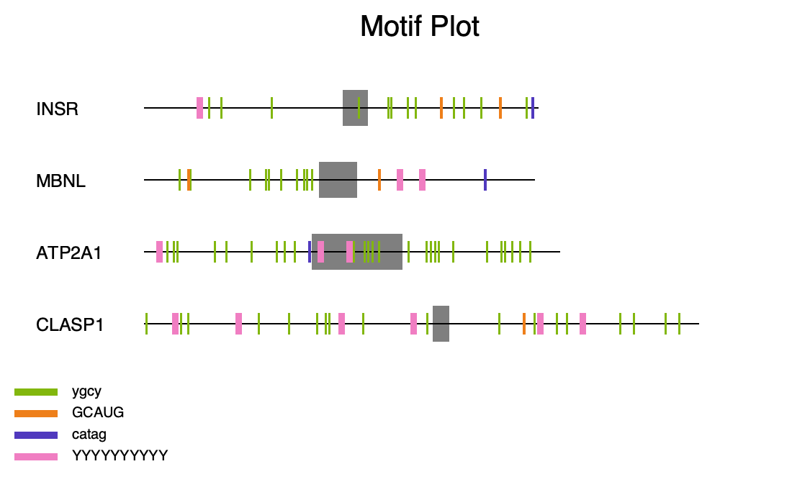

# motif-mark — Sequence Motif Visualization

An object-oriented Python tool that draws gene models to scale and marks the locations of regulatory motifs (including motifs with ambiguous/degenerate IUPAC bases) directly on the sequence.

## Overview

Given a FASTA file of gene sequences (introns in lowercase, exons in uppercase) and a list of short motifs (≤10bp, one per line, IUPAC codes supported), the script:

1. Parses each sequence and identifies exon/intron boundaries from letter case.
2. Searches for every motif, including degenerate bases (e.g. `Y` = C or T), using regex patterns built dynamically from IUPAC ambiguity codes.
3. Renders one gene per row to scale, with introns as a thin line, exons as a solid block, and each motif type drawn in its own consistent color, using [`pycairo`](https://pycairo.readthedocs.io/) for vector drawing.
4. Outputs a single labeled PNG figure with a legend, sized automatically to fit all input genes.

## Usage

```bash
conda create -n my_pycairo pycairo
conda activate my_pycairo
./motif-mark-oop.py -f <input.fasta> -m <motifs.txt>
```

Output is written as `<fasta_prefix>.png` (e.g. `Figure_1.fasta` → `Figure_1.png`).

## Example output

Input: [`Figure_1.fasta`](Figure_1.fasta) + [`Fig_1_motifs.txt`](Fig_1_motifs.txt)



## Skills demonstrated

Object-oriented Python design (Gene/Motif/Exon classes) · regex-based pattern matching with IUPAC ambiguity codes · vector graphics generation with `pycairo` · `argparse` CLI design · bioinformatics file format handling (FASTA)
