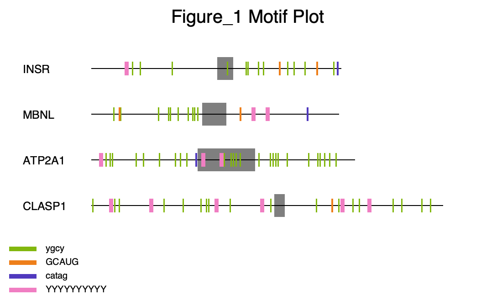

# motif-mark

The objective of this assignment is to create a script named motif-mark-oop.py that processes FASTA and motifs files to generate a labeled PNG figure marking genes, motifs, and exons within DNA sequences.\
\
Input Files:\
A FASTA file containing DNA sequences (each sequence ≤ 1000 bases).\
A motifs file with motifs (each ≤ 10 bases, one motif per line).\
\
The script must use the argparse library with the specified options:\
-f: FASTA file input\
-m: Motifs file input\
\
It will generate an output PNG file with the same prefix as the input FASTA file (e.g., Figure_1.fa → Figure_1.png).\
\
The script must be runnable in the following environment:\
conda create -n my_pycairo pycairo\
conda activate my_pycairo

